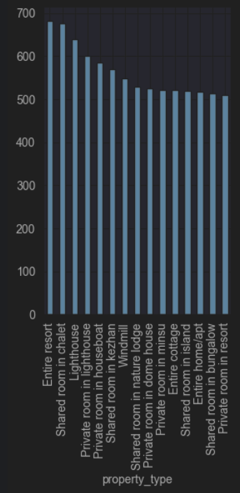

# End Project Report
### 1. Data Loading and Initial Exploration:
- loaded the data using read_csv function.
- the dataset has 279K rows and 33 columns.
- used the head method for the dataframe to see the first few rows of the dataset.

### 2. Data Cleaning:
- missing values: handled missing values by filling them; if it's categorical
we filled it by the mode, otherwise we filled with the median, we had one column **district** with missing values >80%
so we had to drop it.
- the dataset had no duplicate values.
- converted boolean to 0 and 1 and **host_since** column to datetime.
- the dataset also had some outliers so we removed them.
### 3. Exploratory Data Analysis:
- univariate analysis: the data is mostly skewed

- bivariate analysis: we have some interesting plots

### 4. Feature Engineering:
- added **total reviews**, **total reviews**, **hosting year**, **hosting month**, etc.
### 5. Conclusion:
- the dataset shows the skewedness of the hosting pricing and how most of them are very cheap.
- it also shows how newer hostings are mostly pricier than old ones, and 
that the number of hostings is increasing every year.
