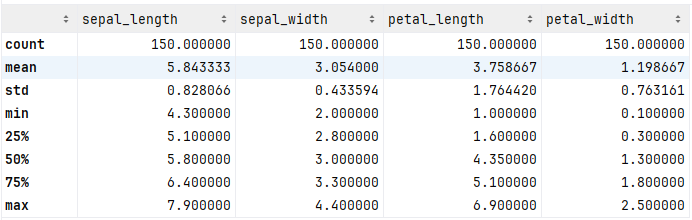
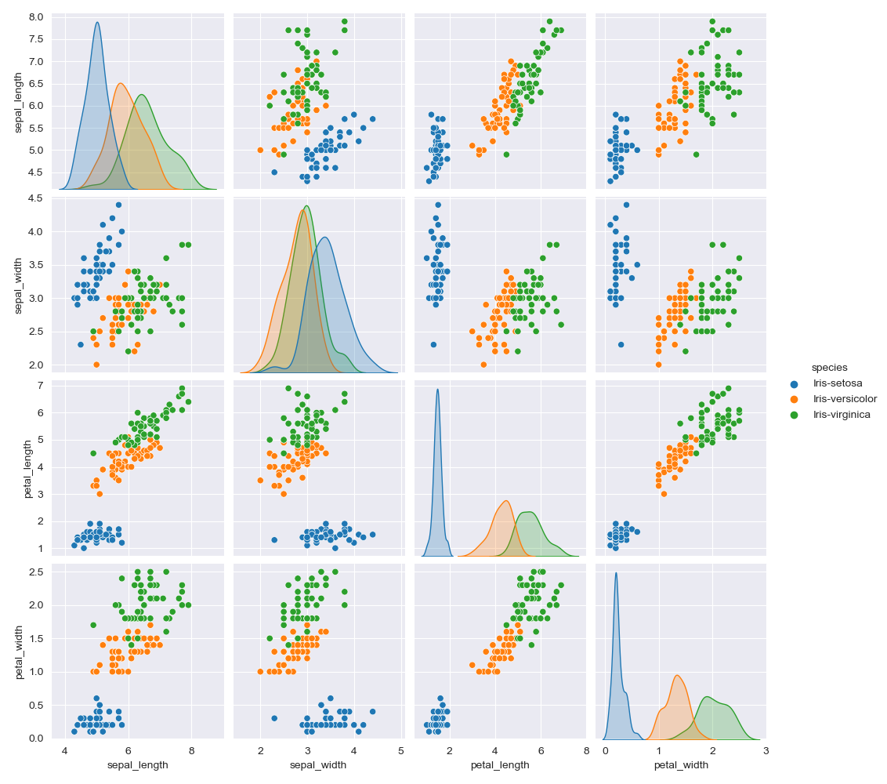
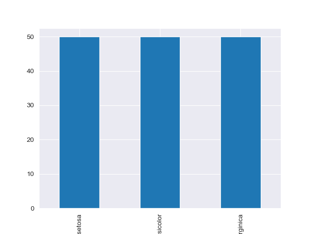
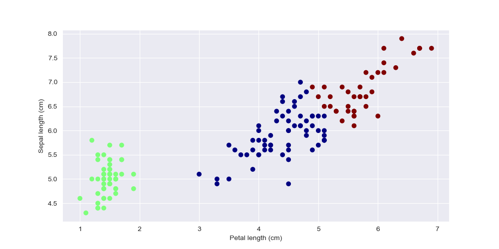
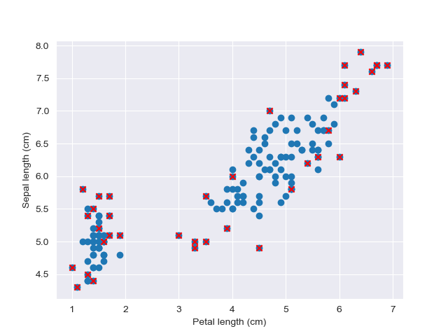

# Project 4 Report

#### Iris Dataset

#### Mohammed Alageel

#### Mazen Alamri

## 1. Data Preprocessing

- Loaded dataset and explored the dataset containing 150 rows and 5 columns.
- The dataset had no null values.
- We used describe() method to see the descriptive statistics of each numeric feature.
- We split the data to x (4 features) and y (the target).
  
  
  

## 2. Unsupervised Learning

- Used K-means clustering to cluster the data.
  
- Used Isolation Forest to find outliers in the data.
  
- We can see how easily K-means clustered the data correctly assuming we know the correct k value,
  but we can use the elbow method to find the best k value.
- The Isolation Forest found outliers outliers but it failed to recognize that the third species is not an outlier.
  but with a dataset with this size (150 rows) we shouldn't remove the 30 outliers we got by using it.

## 3. Supervised Learning

- We chose F1 score (micro) as an evaluation method for the classifier.
- Split the data to training and testing sets.
- We chose Logistic Regression as a baseline classifier and it managed to reach an F1 score of 96.6%.

## 4. Model Comparison

- We chose the following models: SVC, RandomForestClassifier, GradientBoostingClassifier, AdaBoostClassifier,
  CategoricalNB.
- Out of the chosen models the best ones were LogisticRegression, SVC, RandomForestClassifier.

## 5. Model Tuning

- Preformed hyperparameter on logistic regression using grid search.
- We tuned the model on the best hyperparameters and it reached an F1 score of 97.5%.
- Implemented an ensemble (Voting ensemble) of a group of the top performing models and used bagging on each one and got
  94.1% as an
  F1 score.